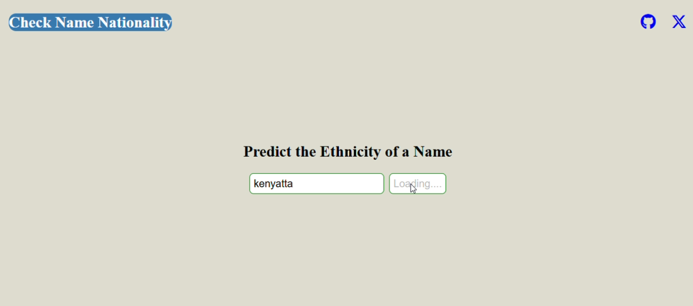

## Check Name Nationality Probability
This a simple web app that predicts the nationality of a name using the [Nationalize API](https://nationalize.io/). The user enters a name, and the app scans the highest probabilty origgin of the name. The app then displays the result of the name and if the name is not   in the API's dictionary it displays "Name not defined or no country data found."

## Web app Images

After a user tries to search a name, in case of a delay, on the search button, **"Loading"** is displayed to tell the user to be patient. Also, after hitting search, the search button is disabled to prevent the user clicking it multiple times and enabled after getting results.

## How to Use

1. Open the web app in a browser of choice.
2. Type a name into the input box.
3. Click the **Search** button.
4. The web app will show the most likely country and probability.

## Technologies Used

- HTML
- CSS
- JavaScript (Vanilla)
- [Nationalize.io API](https://nationalize.io/)

## Author

Made with ❤️ by [Brian Njoroge](https://github.com/briannjoroge)
